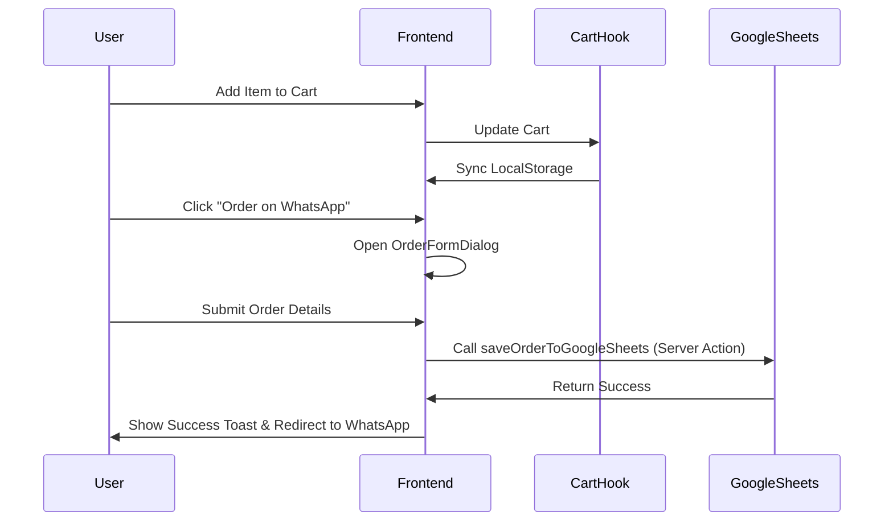

# System Architecture: The Traditional Needle Work

This document provides a comprehensive technical overview of the "The Traditional Needle Work" project, designed to onboard an AI developer with the mental model of the system's architecture, data flow, and core logic.

## 🚀 Tech Stack

- **Framework**: [Next.js 14](https://nextjs.org/) (App Router)
- **Language**: [TypeScript](https://www.typescriptlang.org/)
- **Styling**: [Tailwind CSS](https://tailwindcss.com/)
- **UI Components**: [Radix UI](https://www.radix-ui.com/), [Lucide React](https://lucide.dev/)
- **Animations**: [Framer Motion](https://www.framer.com/motion/), [Embla Carousel](https://www.embla-carousel.com/)
- **AI Stack**: [Firebase Genkit](https://firebase.google.com/docs/genkit), [Google Gemini 2.0 Flash](https://deepmind.google/technologies/gemini/)
- **Database/Storage**: Google Sheets (Orders), Browser LocalStorage (Cart)

## 📁 Directory Structure

```text
src/
├── ai/                # AI logic & Genkit flows
│   ├── genkit.ts      # Genkit configuration (Gemini 2.0 Flash)
│   └── local-ai.ts    # Rule-based NLP for Bengali/English/Banglish intents
├── app/               # Next.js App Router (Pages, Layouts, CSS)
├── components/        # UI Components
│   ├── sections/      # Large page-sections (Hero, Product list, etc.)
│   └── ui/            # Reusable atomic shadcn-like components
├── hooks/             # Custom React hooks (usePersistedCart, etc.)
├── lib/               # Utilities, types, and data
│   ├── products.ts    # Centralized product catalog
│   └── google-sheets.ts # Order submission logic
```

## 🏗️ Core Architecture & Data Flow

### 1. Unified State Management
The application uses a "Single Source of Truth" approach for the shopping cart, managed in `page.tsx` and persisted via `usePersistedCart`.
- **Flow**: `CartState` (React) ↔ `LocalStorage` (Persistence).
- **Communication**: Shared across `Header`, `ProductSection`, and `CartSheet` via props or state lifting.

### 2. Dual-Layer AI Stylist
The AI Assistant uses a hybrid strategy to balance speed and intelligence:
- **Layer 1 (Local AI)**: Uses `fuse.js` for fuzzy matching and `compromise` for NLP. It handles greetings, simple product lookups, and direct ordering in Bengali, English, and Banglish.
- **Layer 2 (Genkit/Gemini)**: Complex fashion queries or lifestyle recommendations are routed to Gemini 2.0 Flash via Genkit.

### 3. Server-Side Integrations
Instead of traditional API routes, the project leverages **Next.js Server Actions** for efficiency:
- **Order Processing**: `saveOrderToGoogleSheets` sends order data directly to a Google Sheets webhook.
- **AI Processing**: AI logic is executed server-side to protect API keys and handle heavy NLP.

## 🔄 Sequence: Placing an Order



## 🎨 Design System & Aesthetics
- **Core Principle**: "Traditional Luxury" - blending warm heritage tones with modern glassmorphism.
- **Primary Color**: Antique Gold (`--primary: 42 78% 55%`).
- **Typography**: Serifs for headings (`font-heading`) and clean Sans-serifs for body.
- **Responsiveness**: Mobile-first with fluid grids and sticky CTAs to ensure accessibility.

## 🛠️ Key Developer Mentions
- **Products**: All product data is currently static in `src/lib/products.ts`. Adding new categories requires updating this file and `intentPatterns` in `src/ai/local-ai.ts`.
- **Integrations**: Environment variables for `NEXT_PUBLIC_GOOGLE_SHEETS_URL` and `GOOGLE_GENAI_API_KEY` are critical for core functionality.
